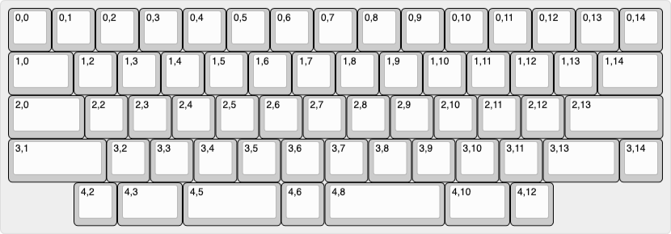

# boethia60

A low profile, hotswap keyboard inspired by the HHBK layout, powered by [rmk](https://github.com/haobogu/rmk) with the rp2040 MCU.

## Features

- Low profile, with compatility for Choc V1 and V2 switches
- Vial support for realtime keymap changes
- HHKB style layout with split spacebars
- ESD protection because winters here are dry AF

## Layout

## Notes

This keyboard was mainly created as a learning experience. Most likely improvements could be made to the trace routing and other aspects.
